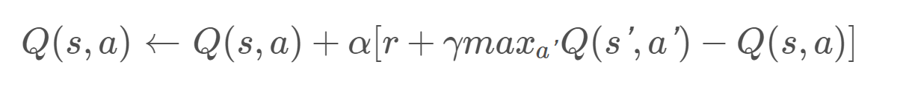

## Summary
We thought it is hard for us to achive something in two weeks by doing the
battle agent. Therefore, we changed out goal into solving the maze problem by
using deep q-learning algorithm. And the goal is that agent can find a way to
the destination in the maze.

***
## Approach
Our maze is a 10x10 matrix, with 20% of maze are gap (wall). The maze is made of
dimand_block as floor, grass as wall, start at an emerald_block, and the
destination is a redstone_block. We view the maze from a 21x21 grid, and store
the position information. We store the whole grid as our states by replacing one
index as "self" after moving. We have four different actions - move north, move
south, move west, and move east. We calculate the reward as - 100 for reach the
goal, -1 for each movement, -50 for touching the wall. Since we use the grid to
store information, we add codes that will stop the agent move beyond the maze.

We use the Deep Q-learning algorithm to train the agent. We use the neural
networks that takes a 21x21 matrix as input, and ouputs a 1x4 matrix that each
index indicates the rewards by choosing four different actions. The neural
network has one hidden layer with the same size as input layer. And update the
old reward by using the function:

And we use MSE as out loss function.

After several tries, we found that the learning is not as good as expected. We
adopted the suggestion from TA Mr. Stephen McAleer that we start at random
position to let the agent learn each part of maze seperately so that it will not
get stuck at the beginning of the maze. We use teleport command before each run
to let agent go to a random position. We subdivide the maze into differnet
areas, and teleport the agent to areas that are close to the destination first,
then move towards to the beginning.

***
## Evaluation

***
## Remaining Goals and Challenges
Still the maze cannot be perfectly solved. And we will continue improving
algorithm by:

1. Building a different model that take the position as input of neural network
   rather than the whole grid, and for each action, we get the seperate output
   to evaluate which is the best one.

2. Probably change the reward function, that is now for each time it reaches the
   goal, the loss function will increase dramatically. And after the discount
   factor close to 0, the "best" action our agent will choose is moving towards
   the wall rather than to the goal. This may be because our reward function is
   not fitted to our method.

3. Probably in the future, we could add monsters in the maze, and the agent will
   learn how to kill those monsters to keep himself safe until reaching the goal.
